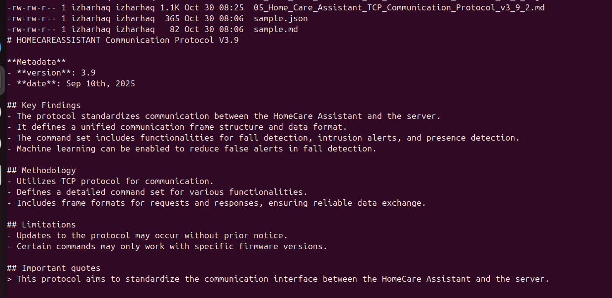

# research-agent — GPT summarizes PDFs → structured reports

**What it does:**  
- Extracts text from a PDF  
- Chunks & summarizes via your LLM API key  
- Validates output to a strict JSON schema  
- Writes `reports/<basename>.json` and optional Markdown

## Quickstart
```bash
python3 -m venv .venv && source .venv/bin/activate
pip install -e .
cp .env.example .env  # add your API key
research-agent examples/sample.pdf --out reports
```
CLI
research-agent INPUT.pdf --out reports --markdown

cat > README.md << 'EOF'
# research-agent — GPT summarizes PDFs → structured reports

**What it does:**  
- Extracts text from a PDF  
- Chunks & summarizes via your LLM API key  
- Validates output to a strict JSON schema  
- Writes `reports/<basename>.json` and optional Markdown

## Quickstart
```bash
python3 -m venv .venv && source .venv/bin/activate
pip install -e .
cp .env.example .env  # add your API key
research-agent examples/sample.pdf --out reports
```
CLI
research-agent INPUT.pdf --out reports --markdown

Layout
• src/research_agent/ core, cli, schema
• prompts/system.md system/policy prompt
• examples/ sample assets
• tests/ unit tests

Notes
• Uses OpenAI SDK by default; provider is swappable via env.

---

## 🖼️ Screenshots

### Research-Agent Terminal Output

Below is the actual summarization result for  
`05_Home_Care_Assistant_TCP_Communication_Protocol_v3_9_2.pdf`.

<p align="center">
  
</p>

> 📘 *Figure: The Research-Agent successfully processes and summarizes a technical PDF into structured Markdown and JSON reports.*

---
